<p align="center">
  
</p>

<p align="center">
  <a href="https://github.com/Gnegnoli">
    
  </a>
</p>

<p align="center">
  <a href="https://gnegnoli.altervista.org/"></a>
  <a href="mailto:acavallaro.ge@gmail.com"></a>
  <a href="https://krypta.altervista.org/"></a>
  <a href="https://tigulliomagicteam.it/"></a>
</p>

---

### 🧙‍♂️ Chi sono

```ts
const gnegnoli = {
  name: 'Andrea Cavallaro',
  based: 'Genova, Liguria 🇮🇹',
  role: 'Full-stack developer',
  stack: ['TypeScript', 'React', 'PHP', 'C#', 'Kotlin', 'Java', 'Node.js'],
  building: ['app web & mobile', 'plugin JetBrains', 'tool per sviluppatori'],
  community: 'Tigullio Magic Team · Krypta Legacy',
  askMeAbout: ['Magic: The Gathering', 'PWA offline-first', 'IDE plugins'],
  website: 'https://gnegnoli.altervista.org',
};
```

### 🚀 Progetti in evidenza

<table>
  <tr>
    <td width="50%">
      <a href="https://github.com/Gnegnoli/krypta-counter"></a>
    </td>
    <td width="50%">
      <a href="https://github.com/Gnegnoli/GithubCodebase3DViewer"></a>
    </td>
  </tr>
  <tr>
    <td width="50%">
      <a href="https://github.com/Gnegnoli/DSPlugin"></a>
    </td>
    <td width="50%">
      <a href="https://github.com/Gnegnoli/PHPDeadCode-ZombieDetector"></a>
    </td>
  </tr>
</table>

### 🛠️ Stack

<p align="center">
  <a href="https://skillicons.dev">
    
    <br>
    
    <br>
    
  </a>
</p>

### 📊 Statistiche

<p align="center">
  
  
</p>

<p align="center">
  
</p>

<p align="center">
  <picture>
    <source media="(prefers-color-scheme: dark)" srcset="https://raw.githubusercontent.com/Gnegnoli/Gnegnoli/output/github-contribution-grid-snake-dark.svg">
    <source media="(prefers-color-scheme: light)" srcset="https://raw.githubusercontent.com/Gnegnoli/Gnegnoli/output/github-contribution-grid-snake.svg">
    
  </picture>
</p>

### 🃏 Community

<table>
  <tr>
    <td>
      Faccio parte del <b><a href="https://tigulliomagicteam.it/">Tigullio Magic Team</a></b>, la community di Magic: The Gathering di Chiavari, Rapallo e Santa Margherita Ligure.
      Per la lega Legacy <b>Krypta Legacy</b> ho sviluppato <a href="https://github.com/Gnegnoli/krypta-counter"><b>Krypta Life Counter</b></a>: contapunti vita gratuito, offline e senza pubblicità, disponibile come web app e app Android.
    </td>
  </tr>
</table>

---

<p align="center">
  
</p>
